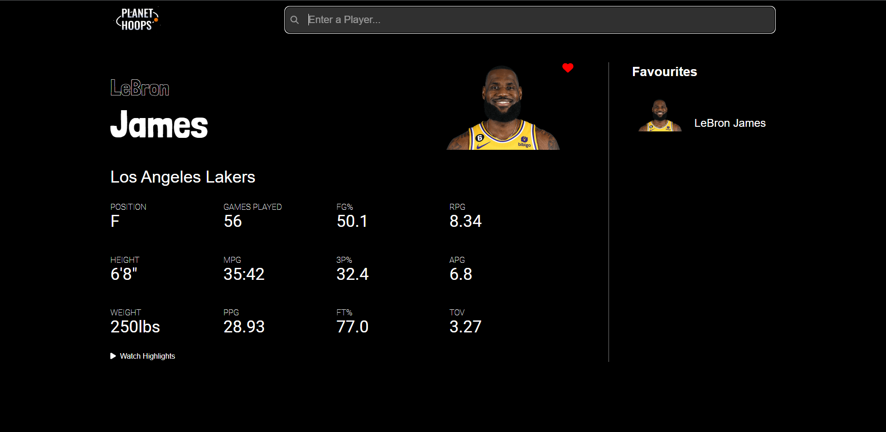

# Planet Hoops

Welcome to Planet Hoops, an app to track and view NBA players stats

View the deployed app here: https://ameer-ahmad.github.io/planet-hoops/

Project Description: Users can search for their favourite NBA players and view their stats. The app displays all main statistics as well as an image of the player. Users can also click a button to watch highlights of the player on YouTube. Users can add the player to a list of favourites. Users can click on any of the players in the favourites list to view the stats for that player.

The features of the app include:
- Search for a NBA Player
- View the statistics for the NBA Player
- Add or remove the player to a list of favourites
- View the stastics for any player from the favourites

Some features I would like to include in the future:
- An empty screen when no player has been chosen
- Add favourites list to local storage
- Error handling when a player with no statistics is chosen

To run this project on your device:
- Clone the github repository
- CD into the repository
- ### `npm install`
- ### `npm start`

## Screenshots

